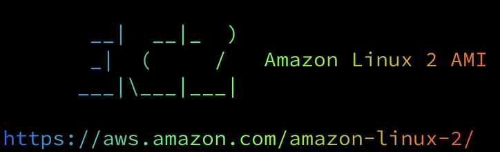

# Free Range Routing on Amazon Linux 2

<p align="center">
 
<br>

</p>

---

## Getting FRR Installed on Amazon Linux

I set this up because I wanted to simple lab to mess around with BGP and IS-IS. I would have used EVE-NG but could not get it to play nice with a bare metal m5 in aws.

1. Create an Amazon Linux 2 instance
2. Use the [free_range_routing.sh](free_range_routing.sh) script for userdata on the instance

## Getting Routers to Route

1. On the security group allow inbound tcp port 179 for bgp and ping for testing
2. Disable source/destination checks on the instance/interfaces
3. Add an IP address to the loopback interface in linux

    ``` console

    sudo ip addr add 1.1.1.1/32 dev lo

    ```

4. Login to frr with *vtysh*

    ``` bash

    service integrated-vtysh-config
    !
    router bgp 65001
     neighbor 172.31.24.201 remote-as 65002
     !
     address-family ipv4 unicast
      network 1.1.1.1/32
     exit-address-family
    !
    end
    !
    write

    ```

---

<p align="center">
 
</p>